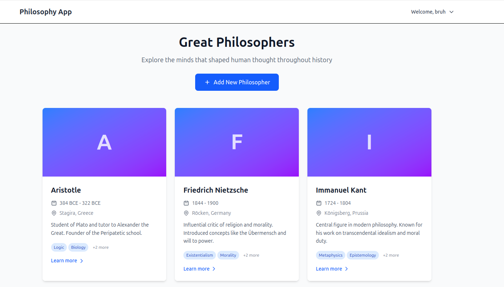
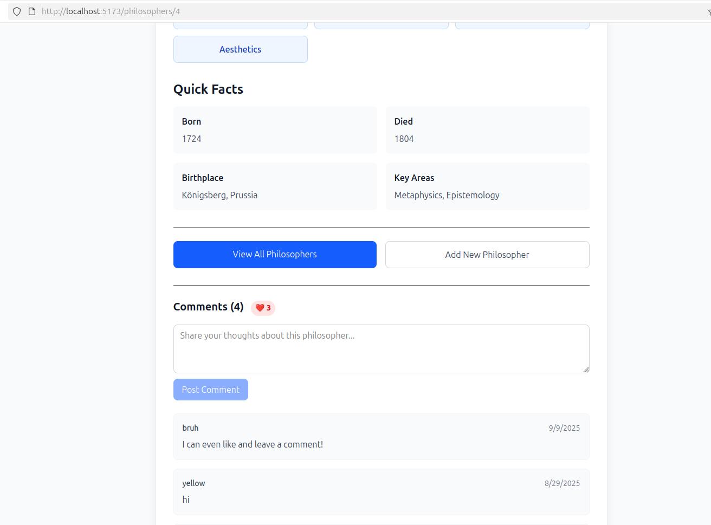

## Overview
This is a production-style full-stack application built with Go and SvelteKit, designed to demonstrate a complete deployment to Google Kubernetes Engine (GKE). 
It includes: 
    Clean Go architecture using dependency injection (repo -> service -> controller)
    gRPC for inter-service communication
    PostgreSQL with type-safe queries (SQLC) and managed migrations (Goose)
    Infrastructure-as-Code via Terraform (VPC, NAT, private GKE cluster, node pools)
    Kubernetes manifests + Gateway API for modern ingress routing



## Application Architecture
Backend:
 - Golang with standard HTTP library
 - Slog library for structured logging
 - Service pattern - repository -> service -> controller layer connect to each other with dependency injection
 - A seaparate gRPC session service which handles all user sessions

Data:
 - [SQLC](https://github.com/sqlc-dev/sqlc) to generate type-safe queries
 - Postgres database
 - Migrations managed by [Goose](https://github.com/pressly/goose)

Frontend:
 - Svelte 5 Typescript and Sveltekit 
 - TailwindCSS

## Infrastructure (Terraform) 
VPC Network: 
 - Custom VPC (main) with no auto-subnets. Regional routing.
   
Subnets:
 - private (10.0.32.0/19): Hosts GKE nodes. Includes secondary ranges for pods (172.16.0.0/14) and services (172.20.0.0/18).
 - proxy-only-subnet (10.129.0.0/23): Dedicated for GKE Gateway API managed proxies.
   
NAT Gateway:
 - Allows private nodes to reach internet.
   
Firewall Rules:
 - Internal traffic allowed between nodes.
   
GKE Cluster:
 - Private nodes, public endpoint (for dev convenience).
 - VPC-native with IP aliasing (uses secondary ranges).
 - Gateway API enabled.
   
Node Pool (small-pool):
 - e2-small preemptible nodes (for cheapness).
 - Autoscaling: only 1–2 nodes.

# To run this project
## Preqrequisites
 - Go 1.21+ — to build and run backend + session services.
 - Node.js 18+ & npm — to run Svelte frontend.
 - Docker — to build and push images to Artifact Registry.
 - kubectl — to deploy and manage Kubernetes resources.
 - gcloud CLI — authenticated to your GCP project (gcloud auth login) and [access configured to kubectl](https://cloud.google.com/kubernetes-engine/docs/how-to/cluster-access-for-kubectl) .
 - Terraform 1.5+ — to provision GCP infrastructure.
     

(Optional — only if regenerating code) 
 - sqlc — if modifying SQL queries and regenerating Go models.
 - Goose — if running or writing new database migrations.
 - protoc + Go gRPC plugins — if modifying .proto files and regenerating gRPC code.
     

## Add missing files ignored by git
I have hidden some secret files on git which include sensitive data, you will need to add your own to run this project.
### Adding kubernetes secrets
You must create a `secrets.yaml` file in `k8s` folder and specify these 4 secrets:
```
apiVersion: v1
kind: Secret
metadata:
  name: app-secrets
  labels:
    app: philosopher
type: Opaque
data:
  pg_user:
  pg_password: bXktYXdlc29tZS1wYXNzd29yZA==
  db_name:
  goose_string: 
```
Create the secrets like this:
```
echo -n "my-awesome-password" | base64               
bXktYXdlc29tZS1wYXNzd29yZA==
```
### Adding terraform tfvars
Then, in the `terraform` folder create `terraform.tfvars` and enter your project_id, default zone and default region of GCP:
```
project_id = "your-project"
region     = "your-region" 
zone       = "your-zone"
```

### Update .env
In the `.env` file set the user and password you will use to connect to postgres

### Testing locally (optional)
Run `make dev`

### Deploy terraform
`cd` into the `/terraform` folder and run `terraform plan` and `terraform apply`

## Deploy application to GCP
### First, update deploy.template.sh
You will also need to update `deploy.template.sh` to add these env variables:
```
PROJECT_ID=""  # Set your actual project ID here
REGION="" # Set your default region
REPO="" # Set the artifact registry repository name
```
### Deploy all the kubernetes files
Run `make deploy-k8s`. On the GCP console you should see all the resources created. Once they are ready, navigate to the external IP address of the gateway to test the full-stack app.

     
